# Learning Platform Template

## Description

Ce projet est une application de gestion de cours en ligne. Il utilise Node.js, Express, MongoDB et Redis pour fournir une API RESTful.

## Installation et Lancement

### Prérequis

- Node.js (version 14 ou supérieure)
- MongoDB
- Redis

### Installation

1. Clonez le dépôt :
   ```bash
   git clone https://github.com/yasser-eddouche/learning-platform-nosql.git
   cd learning-platform-nosql
   ```
2. Installez les dépendances :

   ```
   npm install
   ```

3. Configurez les variables d'environnement : Créez un fichier .env à la racine du projet et ajoutez les variables suivantes :
   ```
   MONGODB_URI=mongodb://localhost:27017
   MONGODB_DB_NAME=learning_platform
   REDIS_URI=redis://localhost:6379
   PORT=3000
   ```

### Lancement

1. Assurez-vous que MongoDB et Redis sont en cours d'exécution :
   ```
   sudo systemctl start mongod
   sudo systemctl start redis-server
   ```
2. Démarrez l'application :

   ```
   npm start
   ```

### Structure du Projet

```
├── src
│   ├── config
│   │   ├── db.js                # Module de connexion aux bases de données
│   │   ├── env.js               # Validation des variables d'environnement
│   ├── controllers
│   │   ├── courseController.js  # Contrôleur pour les cours
│   │   ├── studentController.js # Contrôleur pour les étudiants
│   ├── routes
│   │   ├── courseRoutes.js      # Routes pour les cours
│   │   ├── studentRoutes.js     # Routes pour les étudiants
│   ├── services
│   │   ├── mongoService.js      # Services utilitaires pour MongoDB
│   │   ├── redisService.js      # Services utilitaires pour Redis
│   ├── app.js                   # Point d'entrée de l'application
├── .env                         # Fichier de configuration des variables d'environnement
├── .gitignore                   # Fichier pour ignorer les fichiers et dossiers spécifiques
├── package.json                 # Dépendances et scripts du projet
└── README.md                    # Documentation du projet
```

### Choix Techniques

- Node.js et Express : Pour créer une API RESTful performante et flexible.
- MongoDB : Pour la gestion des données non relationnelles.
- Redis : Pour la gestion du cache et l'amélioration des performances.
- dotenv : Pour la gestion des variables d'environnement.

### Réponses aux Questions Posées dans les Commentaires

- **Comment organiser le point d'entrée de l'application ?** Le point d'entrée de l'application doit initialiser les connexions aux bases de données, configurer les middlewares, monter les routes et démarrer le serveur.
- **Quelle est la meilleure façon de gérer le démarrage de l'application ?** Utiliser une fonction asynchrone pour gérer les connexions aux bases de données et les erreurs, et de s'assurer que toutes les ressources sont correctement fermées lors de l'arrêt de l'application.
- **Pourquoi créer un module séparé pour les connexions aux bases de données ?** Créer un module séparé pour les connexions aux bases de données permet de centraliser la gestion des connexions, de réutiliser le code plus facilement et de faciliter la maintenance.
- **Comment gérer proprement la fermeture des connexions ?** il est important d'utiliser des gestionnaires d'événements pour détecter les arrêts de l'application et fermer les connexions de manière appropriée.
- **Pourquoi est-il important de valider les variables d'environnement au démarrage ?** Pour s'assurer que toutes les configurations nécessaires sont présentes et correctes avant que l'application ne commence à fonctionner.
- **Que se passe-t-il si une variable requise est manquante ?** Si une variable requise est manquante, l'application doit lever une erreur explicative et arrêter son exécution.
- **Quelle est la différence entre un contrôleur et une route ?** Une route définit les points d'entrée de l'API et associe les requêtes HTTP à des fonctions spécifiques, tandis qu'un contrôleur contient la logique métier qui est exécutée lorsque ces routes sont appelées.
- **Pourquoi séparer la logique métier des routes ?** Séparer la logique métier des routes permet de rendre le code plus modulaire, réutilisable et maintenable. Cela facilite également les tests unitaires et l'organisation du code.
- **Pourquoi créer des services séparés ?** Créer des services séparés permet de structurer le code de manière modulaire, de réutiliser les fonctions utilitaires à travers l'application, et de faciliter la maintenance et les tests.
- **Comment gérer efficacement le cache avec Redis ?** Pour gérer efficacement le cache avec Redis, il est important de définir des TTL (Time-To-Live) appropriés pour les données mises en cache, d'invalider le cache lorsque les données sous-jacentes changent, et de surveiller les performances et l'utilisation de la mémoire de Redis. Utiliser des stratégies de cache comme le cache-aside, write-through, ou write-back peut également aider à maintenir la cohérence des données.
- **Quelles sont les bonnes pratiques pour les clés Redis ?** Les bonnes pratiques pour les clés Redis incluent l'utilisation de noms de clés descriptifs et hiérarchiques, l'utilisation de préfixes pour regrouper les clés par fonctionnalité ou module, et l'évitement des clés trop longues ou trop courtes.
- **Quelles sont les informations sensibles à ne jamais commiter ?** Les informations sensibles à ne jamais commiter incluent les mots de passe, les clés API, les jetons d'authentification, les informations de connexion à la base de données, et toute autre information confidentielle qui pourrait compromettre la sécurité de l'application.
- **Pourquoi utiliser des variables d'environnement ?** Utiliser des variables d'environnement permet de séparer la configuration du code, de rendre l'application plus flexible et plus sécurisée.

## Screenshots

### Cours

1. Créer un cours :
   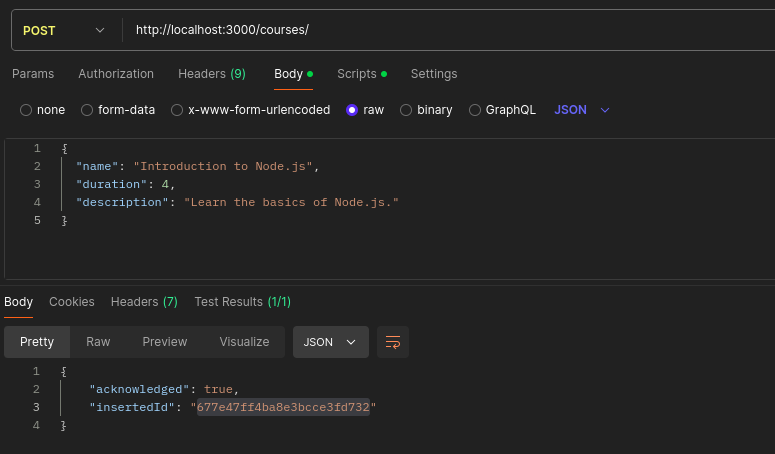

2. Obtenir un cours par ID :
   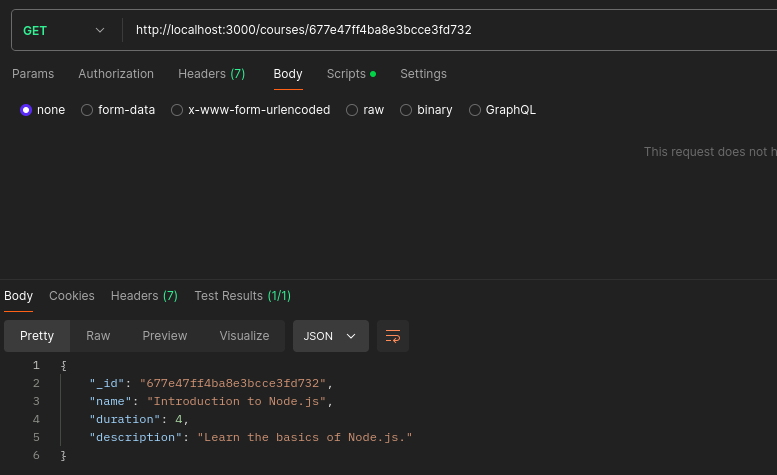

3. Obtenir les statistiques des cours :
   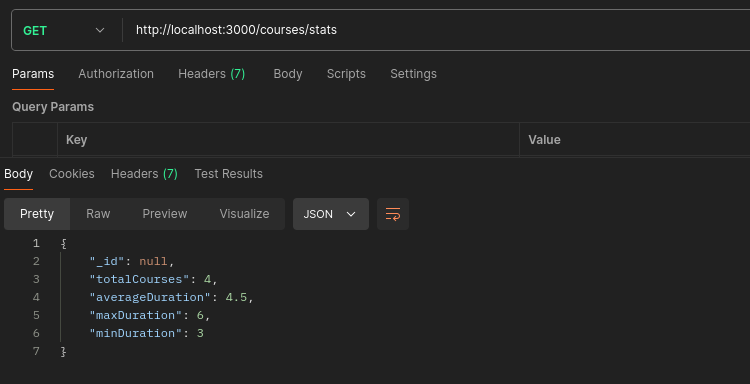

4. Obtenir tous les cours :
   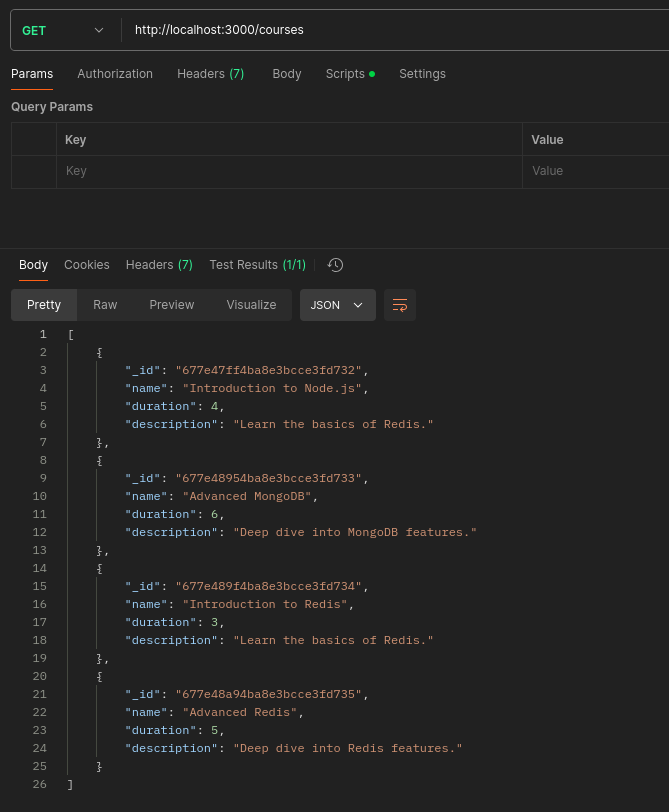

5. Mettre à jour un cours :
   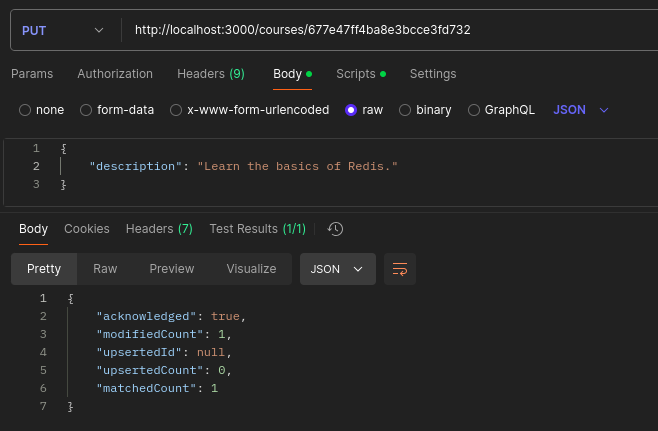

6. Supprimer un cours :
   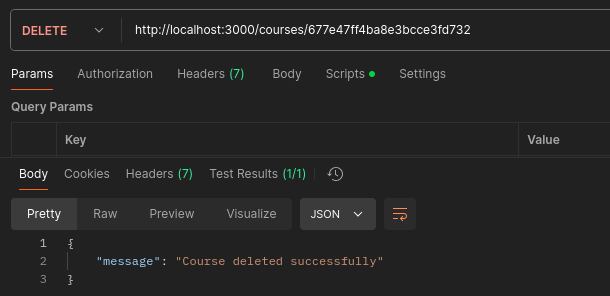

### Étudiants

1. Ajouter un étudiant :
   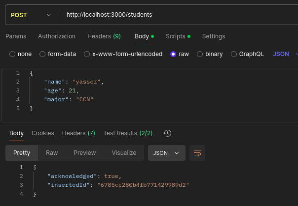
   
2. Obtenir un étudiant par ID :
   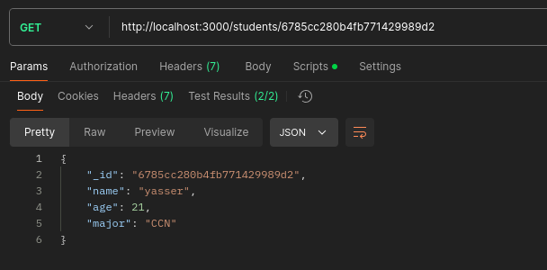

3. Obtenir tous les étudiants :
   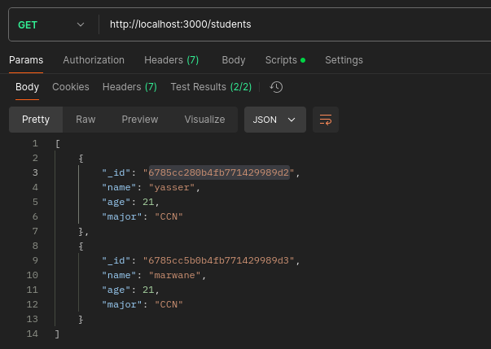

4. Mettre à jour un étudiant :
   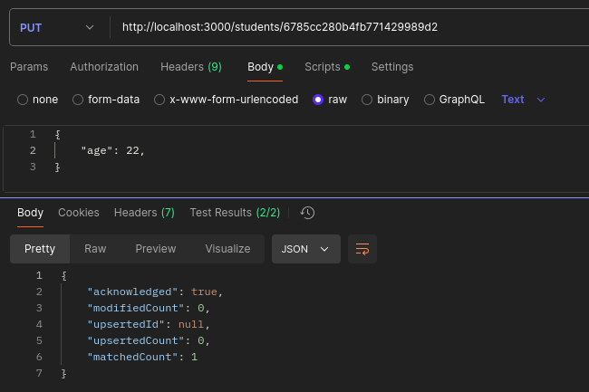

5. Supprimer un étudiant :
   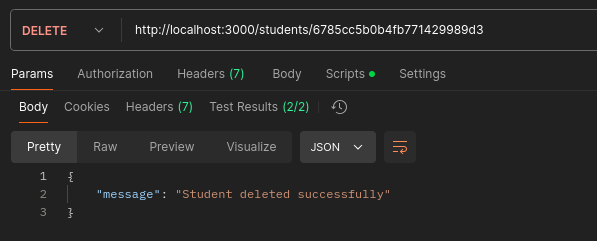
